# General Assembly Project Three, Full-stack MERN application, Group project

## Overview

Project Three was my first experience of building a full-stack, MERN application as part of a group. After a short amount of discussion, we came up with the idea of building the Best London Parks app, a social app for users to share and review their favourite parks, as well as organise groups with associated activities

## Time to build

### 9 days

---

### Visit London Parks **[here](https://london-parks-d997f0328bbb.herokuapp.com/)**!

---

### Please feel free to log in using the following credentials:

**email**: piotr@mail.com \
**password**: Password123

## Code Installation

#### Clone or download the repo than in your Terminal run the following commands:

- Install dependencies `yarn install`
- Start the database in your terminal `mongod --dbpath ~/data/db`
- Start the backend server using `yarn serve`
- Change into front-end folder `cd front-end`
- Run the frontend `yarn start`

## The Brief

- **Build a full-stack MERN application** by making your own back-end and your own front-end
- **Use an Express API to serve your data from a Mongo database**
- **Consume your API** with a separate **front-end built with React**
- **Be a complete product** which most likely means multiple relationships and **CRUD functionality** for at least a couple of models
- **Implement thoughtful user stories/wireframes** that are significant enough to help you know which features are core MVP and which you can cut
- **Be deployed online** so it's publicly accessible.

## Technologies Used

### Back-end:

- Node.js
- MongoDB
- Express
- Bcrypt
- Body-parser
- Mongoose
- jsonwebtoken

### Frontend:

- React
- Axios
- Semantic UI for React
- Http-proxy-middleware
- Nodemon
- React Router Dom
- React Mapbox GL
- React Responsive Carousel
- AccuWeather API
- TFL search travel tool
- Cloudinary.com as image host service
- Framermotion for animations
- React Toastify

### Development tools:

- VS code
- Yarn
- Insomnia
- Git
- Github
- Google Chrome dev tools
- Heroku (deployment)
- Zoom.us for daily stand-ups
- JamBoard for wireframe

## Approach Taken

### Day 1 - Planning

The first step after deciding the nature of the app and getting our initial ideas down on paper was to work on the routes, models and controllers we would need to make sure the app functions how we planned. We had settled on three models in total - The User, The Park, and the comments. After this, we created a basic wireframe for the look of each page and also how users may flow through the app. Wireframe below.
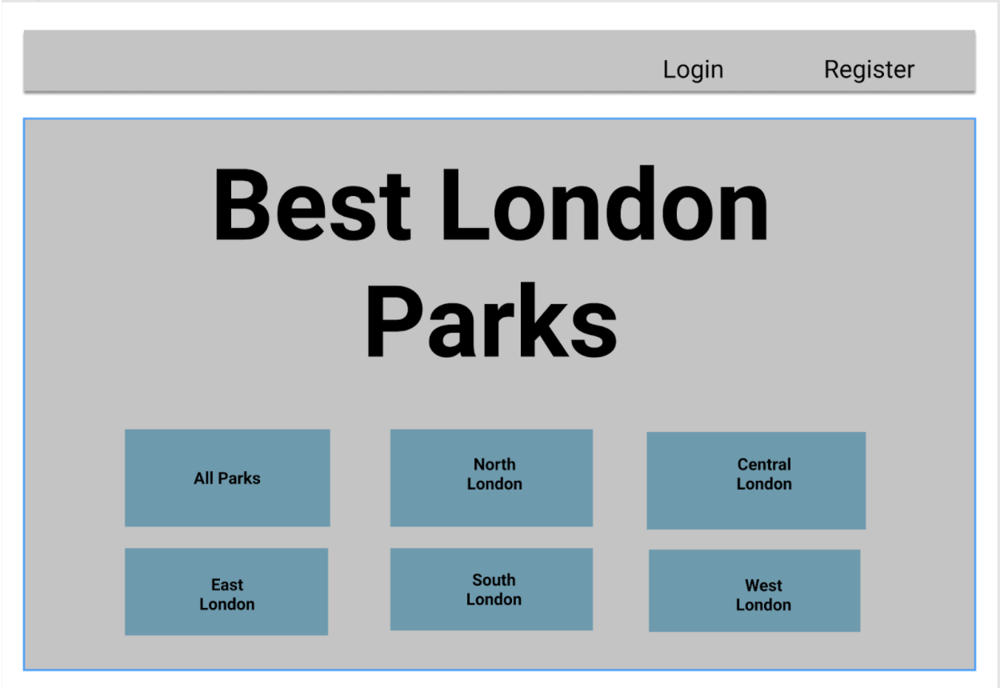
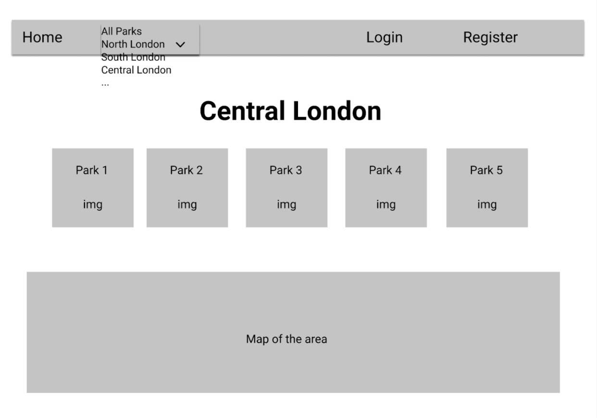
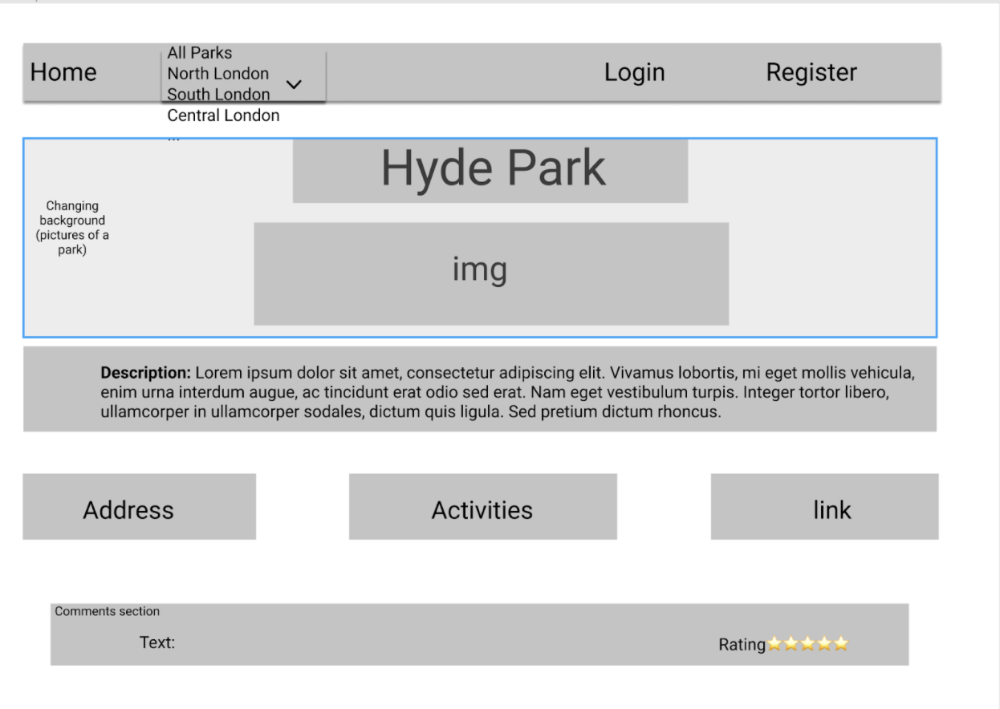

After this, we put together a plan as to how we would divide the work between the three of us. We have decided to do it on a daily sprint basis using Zoom for standups and dividing tasks between us. Because we all wanted to have a hand in creating both back-end and frontend, we decided that it was logical and a good idea to take on building the model schema's, routes, and controllers split with one each. This would then lead us to build the frontend in the same way. Matthew took on models, Mariana started to build our database of London parks including park location, pictures and descriptions. I took over to build all needed routes for all 3 models.

At the very start of the project, we had agreed as a group that we would do a daily morning stand up to discuss any issues or blockers we were having. As this was our first experience of using GitHub on a joint project, we decided that for the initial few days we would do pushes and pulls all together as a group. This was to avoid and fix any potential merging conflicts that we may encounter. In general, we were communicating throughout each day using Slack and Zoom.

## Back-end - Day 2, 3 & 4

Turns out, all routes have been less complicated than I thought. Initially, I had planned on having all CRUD routes on each model, but after standup, we agreed on what is really needed for MVP. All routes include the following CRUD functionality:

#### User model routes:

- **GET**
- **POST**
- **DELETE**
  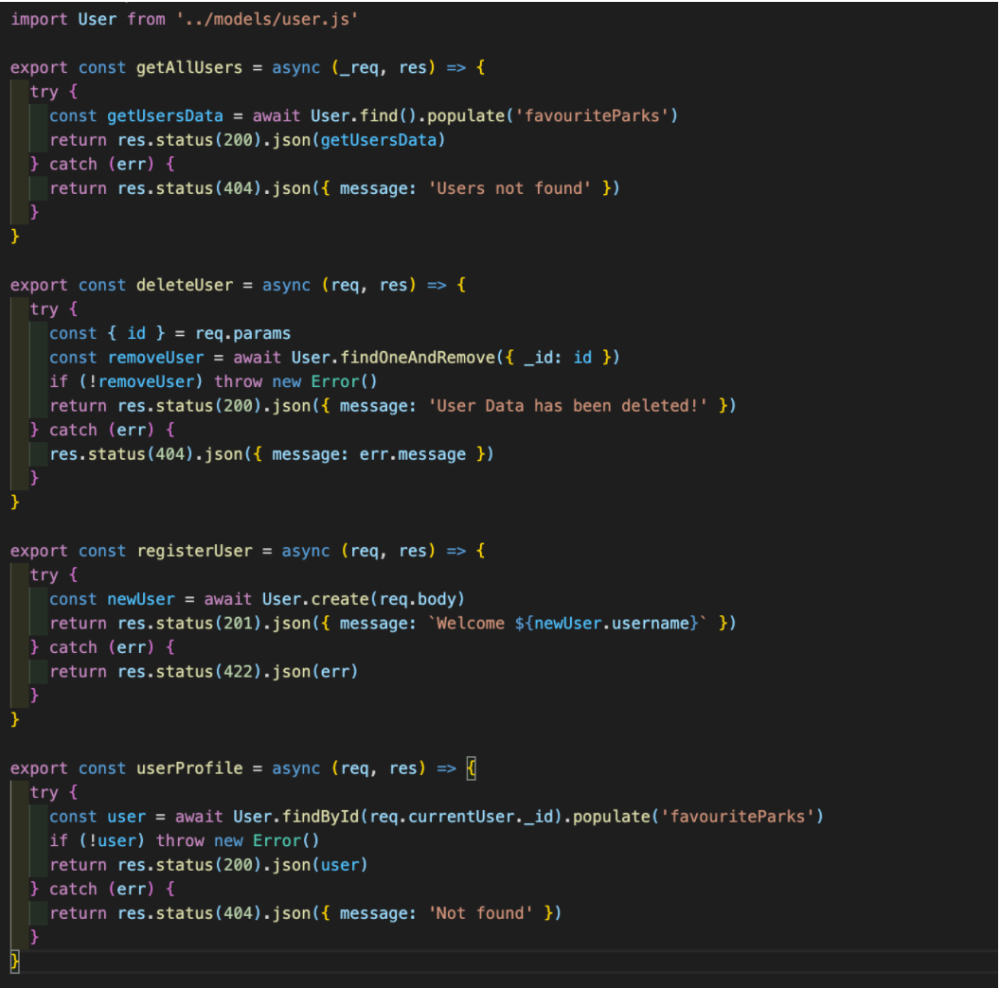

#### Comment model routes:

- **GET**
- **POST**
- **DELETE**
  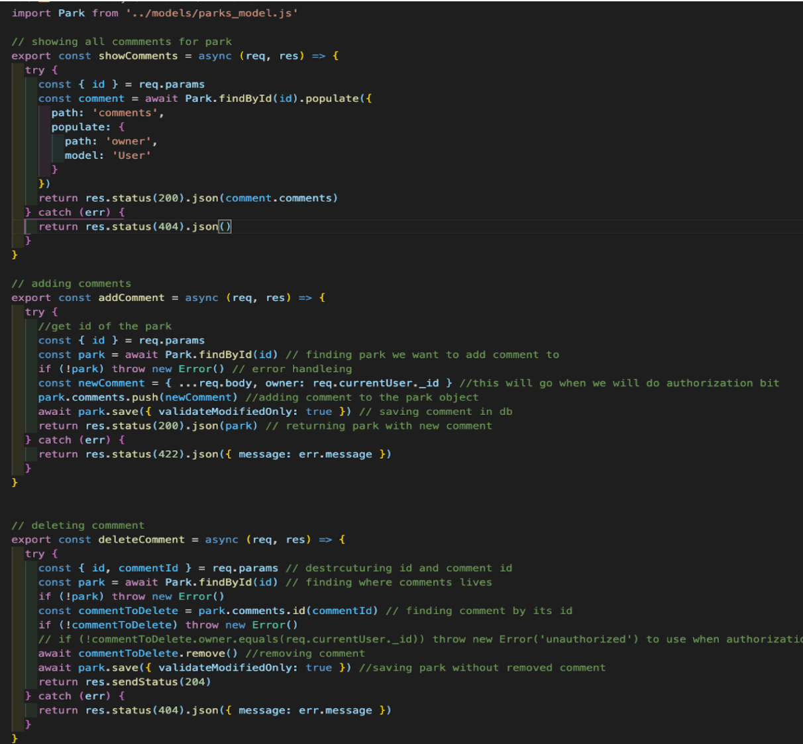

#### Park model routes:

- **GET**
- **POST**
- **PUT**
- **DELETE**
  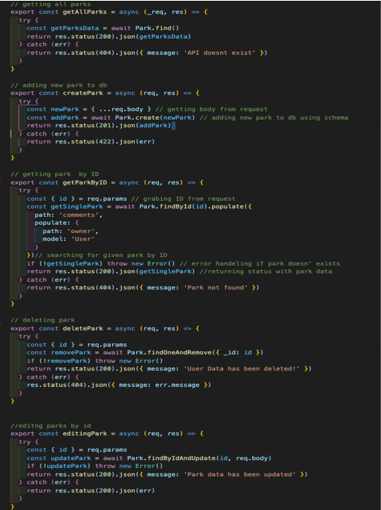

As all needed routes were ready to use we also needed a router, `express.Router()` function turns to be handy with that. Also, a secure route was implemented to give access to certain functionality to chosen users.

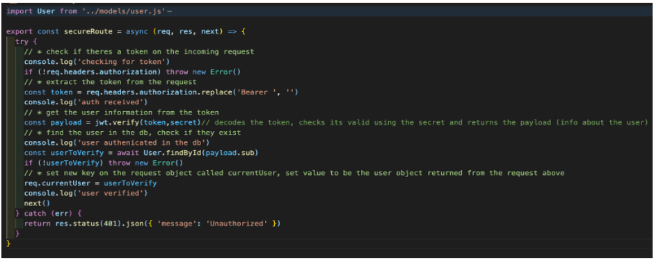
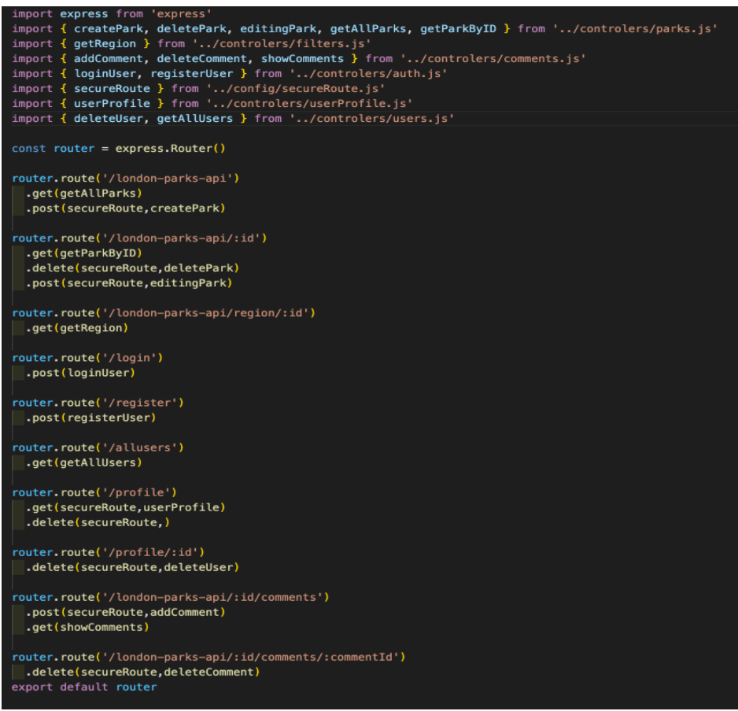

At the end of day 4, we sorted routes, models and seeding databases. All that we have planned for the backend MVP was tested in Insomnia and all major issues were fixed.

## Frontend - Day 5,6,7 & 8

As the backend was ready to use, we paired coded together to connect our new React app as frontend and each of us tested all routes. For testing, we used HTTP-proxy-middleware to link the back-end with the front-end. This enabled us to work on both parts and to quickly make and see changes without having to go through the build process each time. We also used Nodemon for hot-reloading of the browser which again increased our efficiency while building out the front-end.
​​For API requests, we used AXIOS. As we accomplished all tasks fairly quick, we moved to divide our task as it comes:

- Matthew was working on filtering content, ratings, adding travel information to certain parks, navbar positioning and design and an option to add a favourite park.

- Mariana stepped in and worked on comments, AccuWeather API with the next 3-day forecast and activities section.

- I took over the design of all parks and home page sections, registering and login users, image upload using cloudinary.com, user profile page, MapBox, image carousel and add notification blocks using react toastify package.

We decided to use Semantic UI for React for the styling throughout. With this in mind, we wanted to try and build out each component using the Semantic UI framework where possible, to make less work towards the end of the build on general styling so we would have more time to either add more features or neaten up styling and seed more data.

We built the front-end in function-based React. For each section, it was a case of first making sure everything is hooked up and getting/showing the data in the console before then adding the components to show it.

### Home Page

For the London Parks home page, I wanted the user to have the choice of what region of London they would like to check. Initially, for MVP I had decided on just adding the cards with each park. This was very simply achieved by having Semantic UI components to use.

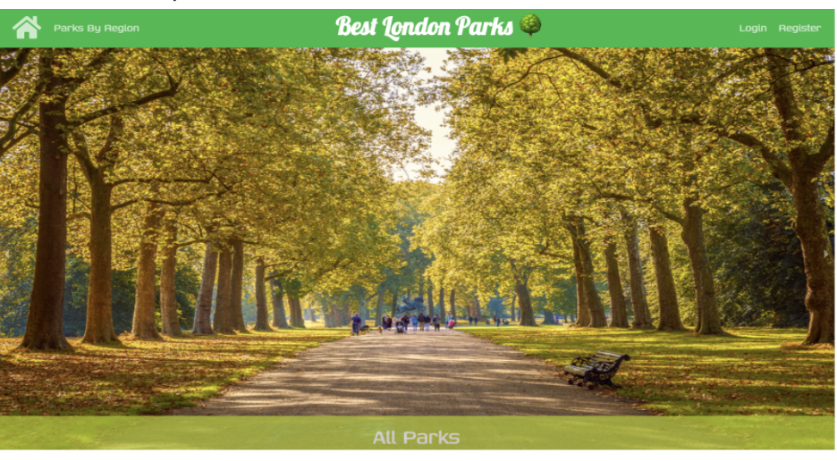

### All parks page

By getting all parks, I had to organise them on the site and also choose what info I wanted to display. At this point, I implemented a framer motion package to add some movement to the website, by adding just a few lines of code I was happy with the accomplished effect. On the next standup, I presented my proposition to my team for design and packages which I wanted to use, as they were happy with the simplicity of the code and ease of using the framer package. I moved on with the next tasks on my list. As parks were displayed and functional, I reorganized cards for each of the parks and I added modals to each of the icons on the park card. 
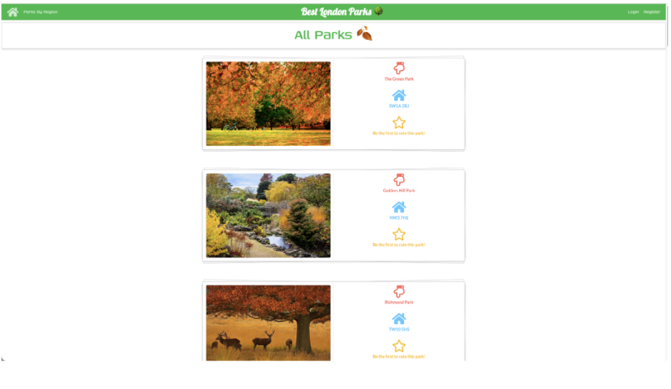

### Login and Register

The design for these functions was pretty simple, sending data to the server wasn’t that straightforward. It took me about half of the day to send data in the correct format and include all information needed. By reading AXIOS documentation and checking my notes from previous projects, by the end of the day my front end was sending correct info to the database.
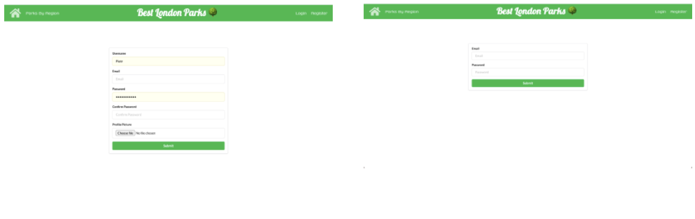

### Image upload to Cloudinary servers

As the registration page was ready to send data to the backend, I had to add a function to upload images from files, not from the URL links which was working till this point. The whole process was complex, as I haven’t implemented functionality like this previously. I had to reach documentation on the Cloudinary website and guidance video from our teacher. After a few hours of coding, I finally got the awaited result.

### User profile page

We decided that the user page will be simple, not much info was asked from the user on the registering. I displayed just the user name and option to delete the profile. Also, I left space for future coming users' favourite parks section.
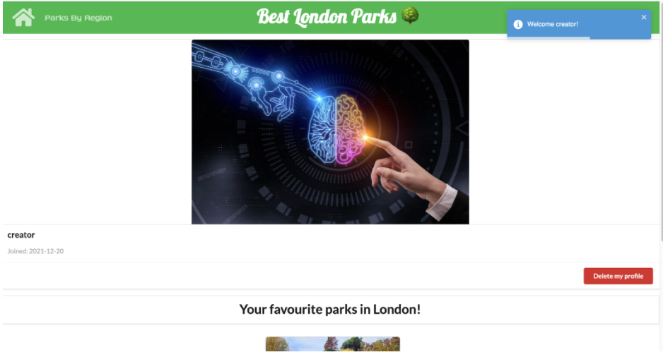

### React MapBox

While adding MapBox functionality, I discovered that I needed to add longitude and latitude to each park. During the standup, it turned out that Mariana needed the same data for AccuWeather API to get correct info about the weather for incoming days. As I found an easy way to a website which converts any UK’s postcode to longitude and latitude, we overcame this challenge fairly quickly. By reading documentation and video guidance from our course lead, I successfully implemented MapBox on our website. 
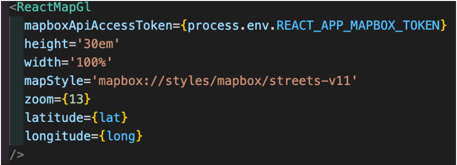

### Image carousel

After taking some time to research about image carousels, I have decided to use React Responsive Carousel. It was easy to install and use in our project, on the downside it hasn’t given much room to style it, but as we agreed, it gives a more professional look to our app.
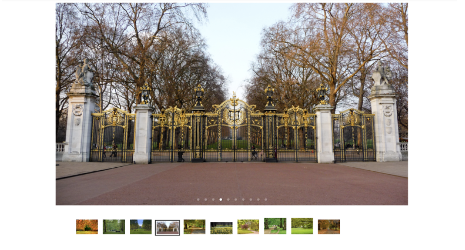

### Site notification with React Toastify

React Toastify is a package which handles notification pop-ups on the website. The initial implementation went smoothly so I made customised pop-us to display user name while login and logout, on adding and deleting comments.
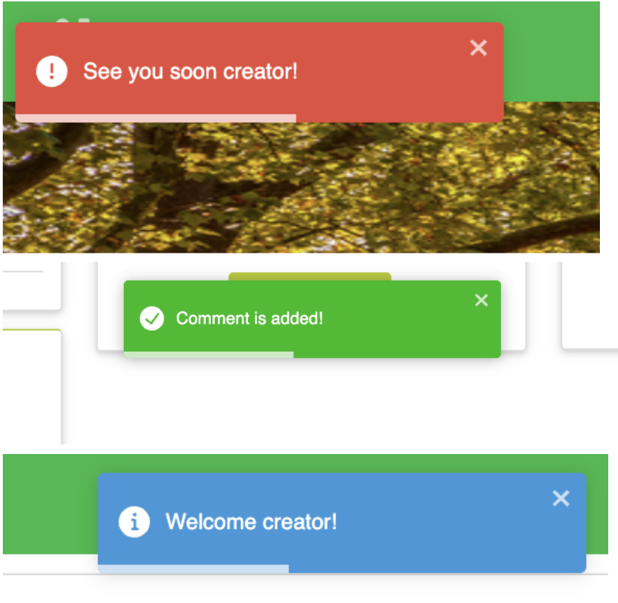

## Last tweaks and styling - day 9

Day 9 was mostly spent styling and adding the correct fonts to buttons and titles etc. All of us were working closely to make sure that the form pages, index pages and show pages were in line with each other and branded in uniform. As we were happy with what we achieved during these 9 days, we decided to finish this day earlier and take some time off.

## Deployment

The app was then deployed on two services, frontend at Heroku and backend API server at MongoDB Atlas. Initially, we linked up the front-end to the back-end and tested locally. As everything was working as expected, we seeded data on MongoDB Atlas and we moved on to deploy the frontend to Heroku.

## Wins and Blockers

### Wins:

A big win personally was that we created a very slick website that has responsive design. I managed to add all of the features we had originally planned. I believe this is because I managed to stick to the schedule well and achieve the targets set out for each day. Also, I really enjoy the time spent with my teammates. It was fun and the first time I was working on a coding project in a larger group. We were bouncing ideas from each other and if we got any bugs that stopped any of us we were jumping on zoom to help out. Coding wise, in this project I have used for the first time many packages like MapBox, Semantic UI and React Toastify. Which gives more confidence and knowledge for future learning.

### Blockers:

The main blocker and challenge for us were using for the first time branches and merging group projects on Github. We were pushing and merging every day together to avoid merging conflicts. Also initially, we planned to use two external API’s, first for the weather which Mariana successfully implemented and second for TFL travelling information to each park. Unfortunately, TFL’s API is so big and nested that we didn’t have enough time to create a search engine for our site. We chose to use an already existing TFL search engine. My personal biggest challenge was to create an image upload to Cloudinary. It was a complex process, it was the first time where I was uploading files to an external server. It took me a while to understand what was going on step by step. Also, MapBox was challenging, the biggest issue with that package was to get latitude and longitude, we have to modify our seed data to get results.

## Bugs

- Unfortunately, after deployment MapBox is not working. 
- When the page is refreshed, it loses connection with API.
- Some extra styling could be done as well.

## Future Content and Improvements

- Profile page to display info about the user.
- Users can visit other users' profiles.
- Fix MapBox issue.
- Users are able to comment on comments.
- Users to be able to add new parks from their profile page.(Park display after admins approval)

## Key Learnings

Working in a group on this project has helped me learn a lot about how I communicate with others and how important it is to keep communicating, especially so early on in our careers. Another thing I took away from the project is being able to push myself further outside of my comfort zone more often. I am sometimes guilty of making decisions that are lower risk but a number of times on this project I had broken code because of trying to add a more challenging feature. During these moments, I really learnt that the tech community is a wonderful thing to be able to lean on to get answers whether that’s through my immediate peers or through social communities on stack overflow etc. Also, I learnt how important it is to read the documentation.
